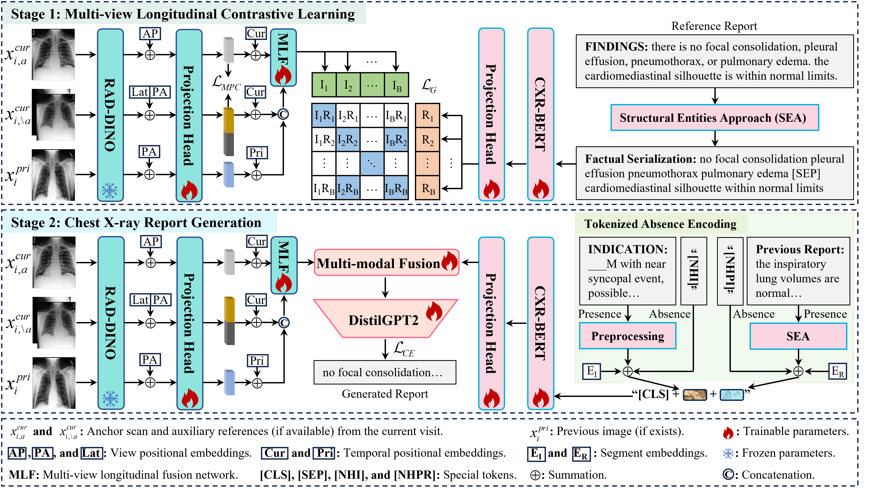

# [Enhanced Contrastive Learning with Multi-view Longitudinal Data for Chest X-ray Report Generation](https://arxiv.org/abs/2502.20056)

Automated radiology report generation offers an effective solution to alleviate radiologists' workload. However, most existing methods focus primarily on single or fixed-view images to model current disease conditions, which limits diagnostic accuracy and overlooks disease progression. Although some approaches utilize longitudinal data to track disease progression, they still rely on single images to analyze current visits. To address these issues, we propose enhanced contrastive learning with Multi-view Longitudinal data to facilitate chest X-ray Report Generation, named MLRG. Specifically, we introduce a multi-view longitudinal contrastive learning method that integrates spatial information from current multi-view images and temporal information from longitudinal data. This method also utilizes the inherent spatiotemporal information of radiology reports to supervise the pre-training of visual and textual representations. Subsequently, we present a tokenized absence encoding technique to flexibly handle missing patient-specific prior knowledge, allowing the model to produce more accurate radiology reports based on available prior knowledge. Extensive experiments on MIMIC-CXR, MIMIC-ABN, and Two-view CXR datasets demonstrate that our MLRG outperforms recent state-of-the-art methods, achieving a 2.3% BLEU-4 improvement on MIMIC-CXR, a 5.5% F1 score improvement on MIMIC-ABN, and a 2.7% F1 RadGraph improvement on Two-view CXR.
<div align=center></div>

## News
-  **2025-03-01** Upload the code, checkpoints, and the [generated radiology reports](generated-radiology-reports) for the MIMIC-CXR, MIMIC-ABN, and Two-view CXR datasets. Notably, in the **generated-radiology-reports**, the **labels** column corresponds to **reference reports**, while the **report** column represents **generated reports**.
-  **2025-02-28** Release [](https://arxiv.org/abs/2502.20056).

## Requirements

- `torch==2.1.2+cu118`
- `transformers==4.23.1`
- `torchvision==0.16.2+cu118`
- `radgraph==0.09`
- please refer to `requirements.txt` for more details.

## Checkpoints

- Checkpoints (pretrain and finetune) and logs for the MIMIC-CXR dataset are available at [Baidu Netdisk](https://pan.baidu.com/s/1Rnwc1ZKhcieBjHoXpHTnlw?pwd=MK13) and [huggingface 🤗](https://huggingface.co/MK-runner/MLRG).

## Datasets
### Medical Images 
- MIMIC-CXR and MIMIC-ABN are publicly accessible through [PhysioNet](https://physionet.org/content/mimic-cxr/2.0.0/), with data systematically organized under root directories labeled `p10` through `p19`, maintaining consistency with MIMIC-CXR's default configuration.
- IU X-ray dataset is publicly available at [NIH](https://openi.nlm.nih.gov/faq#collection), and its root directory is the `NLMCXR_png`.
- Two-View CXR dataset: the `NLMCXR_png` + MIMIC-CXR images. Two-view CXR aggregates studies with two views from MIMIC-CXR [1] and IU X-ray [2]. For more details, please refer to [arXiv](https://arxiv.org/abs/2411.10224).
- The comprehensive file architecture for all datasets is structured as delineated below:
```
files/
├── p10
    └── p10000032
            └── s50414267
               ├── 02aa804e-bde0afdd-112c0b34-7bc16630-4e384014.jpg
               └── 174413ec-4ec4c1f7-34ea26b7-c5f994f8-79ef1962.jpg
├── p11
├── p12
├── p13
├── p14
├── p15
├── p16
├── p17
├── p18
├── p19
└── NLMCXR_png
   ├── CXR1_1_IM-0001-3001.png
   ├── CXR1_1_IM-0001-4001.png
   └── CXR2_IM-0652-1001.png
```
### Raw Radiology Reports
- MIMIC-CXR and MIMIC-ABN: [PhysioNet](https://physionet.org/content/mimic-cxr/2.0.0/).
- Two-view CXR: [huggingface 🤗](https://huggingface.co/datasets/MK-runner/Multi-view-CXR)
### Reorganization of Raw Radiology Reports
- To streamline usage, we have structured multi-view longitudinal data using the `study_id`. The processed data can be accessed on [huggingface 🤗](https://huggingface.co/MK-runner/MLRG/tree/main/radiology%20report) (PhysioNet authorization required). Notably, due to the absence of `study_id` in the `NLMCXR_png` (i.e., IU X-ray dataset), IU X-ray dataset does not include previous visit data.

## Evaluation using generated radiology reports
```
def compute_performance_using_generated_reports():
    from tools.metrics.metrics import compute_all_scores, compute_chexbert_details_scores
    mimic_cxr_generated_path = 'generated-radiology-reports/MIMIC-CXR/test_reports_epoch-1_20-10-2024_16-28-28.csv'
    mimic_abn_generated_path = 'generated-radiology-reports/MIMIC-ABN/test_reports_epoch-1_23-10-2024_10-25-20.csv'
    twoview_cxr_generated_path = 'generated-radiology-reports/Two-view CXR/test_reports_epoch-0_25-10-2024_11-38-35.csv'
    args = {
        'chexbert_path': "/home/miao/data/dataset/checkpoints/chexbert.pth",
        'bert_path': "/home/miao/data/dataset/checkpoints/bert-base-uncased",
        'radgraph_path': "/home/miao/data/dataset/checkpoints/radgraph",
    }
    for generated_path in [mimic_cxr_generated_path, mimic_abn_generated_path, twoview_cxr_generated_path]:
        data = pd.read_csv(generated_path)
        gts, gens = data['labels'].tolist(), data['report'].tolist()
        scores = compute_all_scores(gts, gens, args)
        print(scores)
```

## Reproducibility on MIMIC-CXR

---

1. Download checkpoints for evaluation or initialization.
- For CE metrics calculation: `chexbert.pth`, `radgraph`, and `bert-base-uncased`.
- For model initialization: `microsoft/rad-dino` (image encoder), `microsoft/BiomedVLP-CXR-BERT-specialized` (text encoder), `distilbert/distilgpt2` (define text generator), and `cvt2distilgpt2` (initialize text generator).
- Checkpoint directory: Place all checkpoints in a local directory (e.g., "/home/data/checkpoints"), and configure the `--ckpt_zoo_dir /home/data/checkpoints` argument in the corresponding `script/**/**.sh` file.

<div style="margin: 0 auto; width: fit-content;">
      
| **Chekpoint**                    | **Variable\_name** | **Download**                                                                          |
| :------------------------------- | :----------------- | :------------------------------------------------------------------------------------ |
| chexbert.pth                     | chexbert\_path     | [stanfordmedicine](https://stanfordmedicine.app.box.com/s/c3stck6w6dol3h36grdc97xoydzxd7w9)       |
| bert-base-uncased                | bert\_path         | [huggingface](https://huggingface.co/google-bert/bert-base-uncased)                   |
| radgraph                         | radgraph\_path     | [PhysioNet](https://physionet.org/content/radgraph/1\.0.0/)                           |
| microsoft/rad-dino               | rad\_dino\_path    | [huggingface](https://huggingface.co/microsoft/rad-dino)                |
| microsoft/BiomedVLP-CXR-BERT-specialized               | cxr\_bert\_path    | [huggingface](https://huggingface.co/microsoft/BiomedVLP-CXR-BERT-specialized)              |
| distilbert/distilgpt2              | distilgpt2\_path    | [huggingface](https://huggingface.co/distilbert/distilgpt2)                |
| cvt2distilgpt2              | cvt2distilgpt2\_path    | [github](https://github.com/aehrc/cvt2distilgpt2)                |
</div>

---

2. Conducting Stages 1 and 2
```
# Stage 1: Multi-view Longitudinal Contrastive Learning
cd script/MIMIC-CXR
bash run_cxr_pt_v0906_fs.sh
# Stage 2: Chest X-ray Report Generation based on Patient-specific Prior Knowledge
cd script/MIMIC-CXR
bash run_cxr_ft_mlrg_v1011.sh
```

---

## Citations

If you use or extend our work, please cite our paper at CVPR 2025.

```
@misc{liu2025-mlrg,
      title={Enhanced Contrastive Learning with Multi-view Longitudinal Data for Chest X-ray Report Generation}, 
      author={Kang Liu and Zhuoqi Ma and Xiaolu Kang and Yunan Li and Kun Xie and Zhicheng Jiao and Qiguang Miao},
      year={2025},
      eprint={2502.20056},
      archivePrefix={arXiv},
      primaryClass={cs.CV},
      url={https://arxiv.org/abs/2502.20056}, 
}
```


## Acknowledgement
- [cvt2distilgpt2](https://github.com/aehrc/cvt2distilgpt2) Some codes are adapted based on R2Gen.
- [MCL](https://github.com/mk-runner/MCL) Some codes are adapted based on MCL.

## References
[1] Nicolson, A., Dowling, J., & Koopman, B. (2023). Improving chest X-ray report generation by leveraging warm starting. Artificial Intelligence in Medicine, 144, 102633. 

[2] Liu, K., Ma, Z., Xie, K., Jiao, Z., & Miao, Q. (2024). MCL: Multi-view Enhanced Contrastive Learning for Chest X-ray Report Generation. arXiv preprint arXiv:2411.10224.
